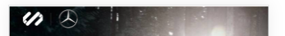

#### 作者

张明

#### 组件介绍

自定义 Header 组件，动态获取 statusBar 的高度，设置头部状态栏距离。

#### 组件缩略图



#### 使用

```html
<sp-header>
  <slot></slot>
</sp-header>
```

#### props

| 参数     | 类型   | 默认值 | 可选项                                                           | 说明                           |
| -------- | ------ | ------ | ---------------------------------------------------------------- | ------------------------------ |
| position | String | fixed  | fixed: 脱离文档流，固定在顶部；<br>relative：status bar 占位作用 | 页面 header 在页面中的定位类型 |

#### Slot

| name    | 说明        |
| ------- | ----------- |
| default | header 内容 |
